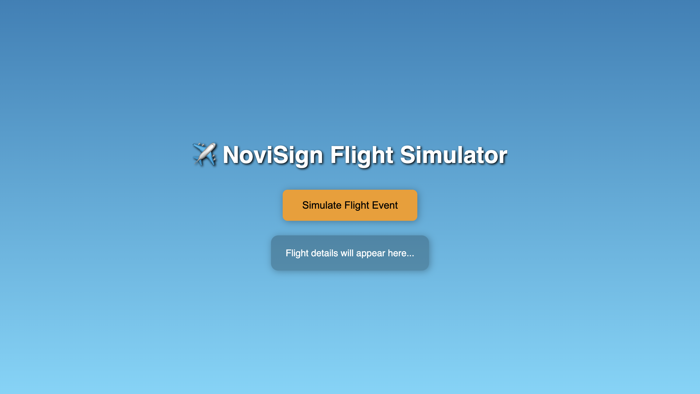
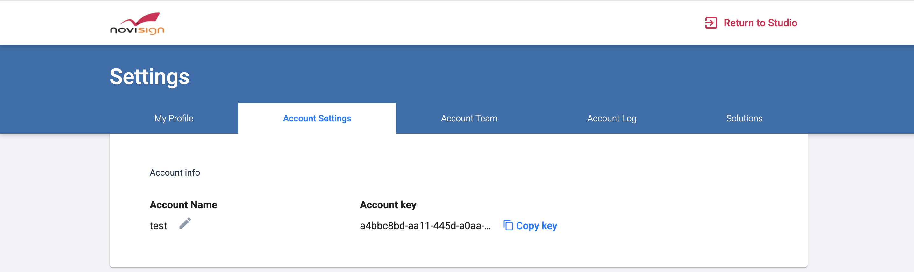

# NoviSign Events API Demo

This demo showcases the **NoviSign Events API**, illustrating how to integrate with NoviSign's event system to trigger and manage flight simulator events in real-time.

## Features
- Simulate flight events through the NoviSign Events API
- Display dynamic flight data on the web interface
- Real-time event triggering and response handling

## Installation

### Prerequisites
- Node.js installed on your system

### Setup Steps

1. **Initialize the project:**
   ```bash
   npm init -y
   ```

2. **Install all dependencies:**
   ```bash
   npm install express axios dotenv
   ```

3. **Configure environment variables:**
   - Create a `.env` file in the root directory
   - Add your NoviSign API configuration:
   ```
   NOVISIGN_URL=https://app.novisign.com/catalog/items/flight-event
   NOVISIGN_API_KEY='your_api_key_here'
   ```

4. **Start the server:**
   ```bash
   node server.js
   ```

5. Open the application at `http://localhost:3000`
You should see this page where you can manually trigger event to the screen
<div align="center">
  
</div>

In order to setup Novisign Event API start with loading `flight-event.nvc`

<details>
<summary>Step 1: Fix the Missing Account Key (Expected Errors)</summary>

<video src="https://github.com/user-attachments/assets/1b21ab26-67f6-4281-b25c-db49e5405c03" controls="controls"></video>

After importing the creative and opening it in **Edit mode**, you will notice **errors indicators**.

This is expected.

The errors appear because the creative was exported **without your personal NoviSign Account Key**.

You only need to fix this **once**.

1. Go to: Load Preview Parameters
2. Click `Click to change`
3. Click Edit to `Flight`
4. In the **API URL** field: `https://app.novisign.com/catalog/{YOUR-ACCOUNT-KEY}/items/flight-event`

Replace `{YOUR-ACCOUNT-KEY}` with your actual **NoviSign Account Key**.

5. Save the changes

---
## **How to Get Your NoviSign Account Key**

Go to **Profile Settings → Account Settings**.

Copy the value labeled **Account Key**.

<div align="center">
  
</div>

</details>

<details>
<summary>Step 2: Set event to screen</summary>

<video src="https://github.com/user-attachments/assets/e961bb96-fcc2-4349-8084-c1476f67cea5" controls="controls"></video>

### 1. Access the Screens Tab
From the top navigation menu, click on the **Screens** tab.

### 2. Enter Screen Edit Mode
Locate the screen you wish to configure. Hover over the screen thumbnail and click the **Edit (pencil) icon**.

### 3. Open the Events Section
Inside the screen editor, look for the options bar above the playlist area. Click the **Events** button located next to "Copy Screen Key."

### 4. Initialize New Event
Click the pink **New Event** button on the left-hand side to start the setup wizard.

### 5. Select Your Creative
You will be prompted to "Set Up Creative."

* Browse through your library.
* **Click on the thumbnail** of the creative you want to use.
* Click the **Set** button in the top right corner.

<video src="https://github.com/user-attachments/assets/d0254baa-3260-43fa-a0e6-a6cc19830507" controls="controls"></video>

### 6. Configure General Event Settings
In the **General** tab of the Event settings (Step 1 of 3), define how the event is identified and activated:
* **Event Name:** Enter a name for the event (e.g., typing `flight-event`).
* **Event Duration (sec):** Set the length of time the event stays active (e.g., `10` seconds).
* **Trigger by:** Select a trigger from the dropdown menu (e.g., selecting `Just number 1`). if you don't have any trigger contact novisign support team.
* Click **Next** to proceed.

### 7. Set Event Position
In the **Position** tab (Step 2 of 3), choose how the event content is displayed on the screen:
* **Set layout:** Select a layout preset (e.g., "Full", "Center", or various grid ratios like "1:2", "2:1", etc.).
* View the **Set position** preview on the right to confirm the placement.
* Click **Next** once the layout is selected.

### 8. Customize Style & Sound
In the **Event style & Sound** tab (Step 3 of 3), finalize the visual transitions:
* **Border:** Choose a border style if required.
* **Transition Animation:** Select an entry animation (e.g., "Fly Up", "Slide left", "Fade in", or "No Transition").
* **Animation Duration:** Set the speed of the transition (e.g., "0.2" seconds).
* **Background:** Select a background color.
* Click **Finish** to save these settings.

### 9. Finalize and Update Screen
You will be returned to the main Events dashboard where your new event (e.g., "flight-event") is listed:
* Review the summary of the **General**, **Position**, and **Style & Sound** tabs.
* Click the **Update** button in the top right corner of the screen editor to push the changes to your display.

See video below:

---
</details>
<details>
<summary>Step 3: Create Screen Configuration</summary>

### Create Screen Configuration
This step tells the player exactly where to pull real-time data from and which event to trigger.

<video src="https://github.com/user-attachments/assets/ff167325-b700-474d-8196-eece3e58b579" controls="controls"></video>

1. **Navigate:** Click your **account name** in the top right > **Advanced Settings** > **Configurations**.
2. **Create:** Click the blue **+ New Configuration** button.
3. **Identify:** Under **Config Name**, enter `flight-updates`.
4. **Activate API Integration:** Scroll down to **API Integration**, check the box, and click **"Click to change"**.
5. **Connect:** Click **Add** and enter these specific details:
   - **Name:** `flight`
   - **API URL:** `https://app.novisign.com/catalog/{YOUR-ACCOUNT-KEY}/items/flight-event`
   - **Property key:** `flightUpdate`
   - **Enable:** Send event on change `RFID:1`

⚠️ **Important:** Replace `{YOUR-ACCOUNT-KEY}` with your actual Account key!

6. **Save:** Click **Save**, then **OK**, and finally click the blue **Update** button at the top.

</details>

<details>
<summary>Step 4: Link Configuration to Your Screen</summary>

### Link Configuration to Your Screen
This step links your API configuration to the screen, ensuring that the player automatically retrieves and applies your custom data settings upon launch.

<video src="https://github.com/user-attachments/assets/a8eed0d6-501c-4fb8-b96e-b610180f4a33" controls="controls"></video>

1. **Navigate:** Click **Screens** in the top menu.
2. **Configure:** Find your screen (e.g., `My First Screen`), click the **three dots (menu)** in the bottom right corner of the screen thumbnail, and select **Set Configuration**.
3. **Select:** Choose the `flight-updates` you created earlier.
4. **Confirm:** Click **OK**. Your screen is now "data-aware."


</details>
